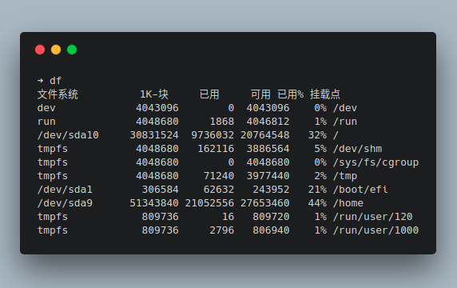

前些天把很久没用的 Windows10 更新了下，更新后就进不了 Linux 系统了，提示 "file '/boot/grub/x86_64-efi/normal.mod' not found"，之后就进入 grub rescue 模式了

解决方法很简单，在 grub rescue 模式下找到系统的启动分区，手动启动系统，之后重新安装 grub 到 efi 分区即可

<!-- more -->

### grub rescue 下的操作

```bash
# 查看设备和分区情况
grub rescue> ls
(hd0) (hd0, gpt2) (hd0, gpt1) ...
# 查看分区文件确定启动分区位置
grub rescue> ls (hd1, gpt10)/
# 设置启动分区，载入启动需要的模块
grub rescue> set root=(hd1, gpt10)
grub rescue> set prefix=(hd1, gpt10)/boot/grub
grub rescue> insmod normal
grub rescue> normal
```

执行完 normal 命令后，顺利的话就能进入系统了

### 查找 boot/efi

通过命令 **df** 查看 boot/efi 所在挂载点

<!--  -->



### 重新安装 grub

```bash
➜ sudo grub-install /dev/sda1
```